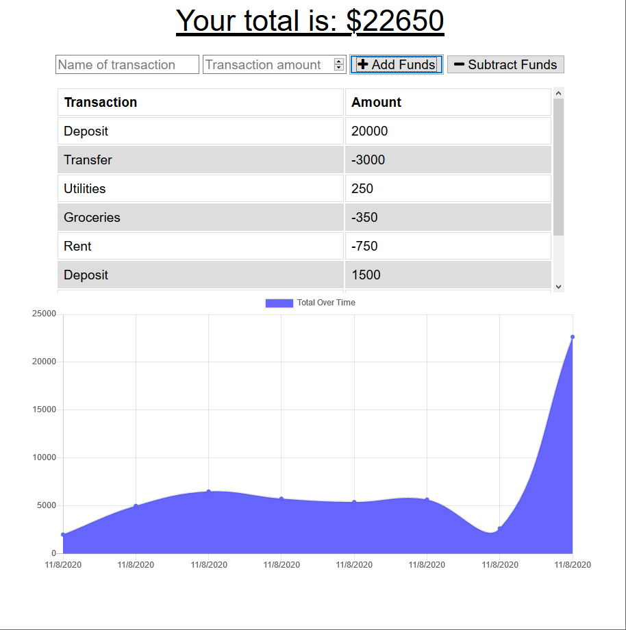

# BUDGET TRACKER


  

 
 
  
 

 ## Table of Contents:  

[1. Description](#Description)  
[2. Acceptance Criteria](#Acceptance-Criteria)  
[3. Screen Shots](#Screen_Shots)  
[4. Installation](#Installation)  
[5. License Details](#License-Details)  
[6. Submission](#Submission)   
[7. Questions](#Questions)  

## Description:  

The user, avid traveler, wants to be able to track their withdrawals and deposits with or without a data/internet connection so that their account balance is accurate while traveling .

## Acceptance Criteria  
- Given a budget tracker without an internet connection
- When the user inputs an expense or deposit, they will receive a notification that they have added an expense or deposit
- When the user reestablishes an internet connection, then the deposits or expenses added while they were offline are added to their transaction history and their totals are updated


## Screen Shots
  

## Installation
1. download the repo from the link below  
2. open a terminal window  
3. Run the following at the command line
```
    $ npm install
```
4. Start the app
```
    $ npm start
```
5. open locally on your browser using 
```
    http://localhost:3001/
```

## License Details  
This project is under no license

## Submission  
[Employee Tracker repository](https://github.com/civ187/BudgetTracker)  
[Deployed App](https://vclbudgettracker.herokuapp.com)  

## Questions:  
 Here is a link to my github:  
https://github.com/civ187  
 Email me at:  
civ187@gmail.com  
for additional questions
